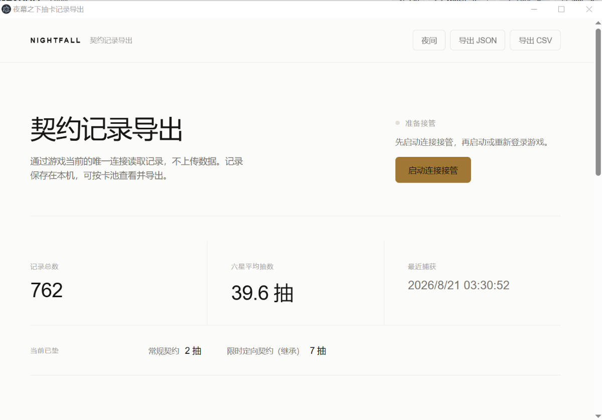
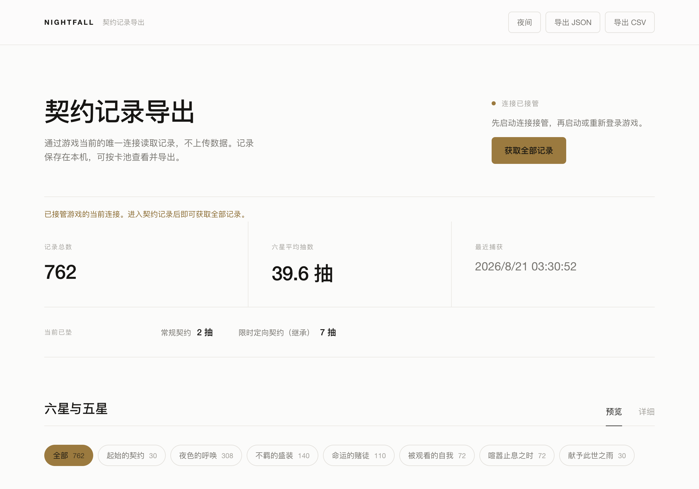
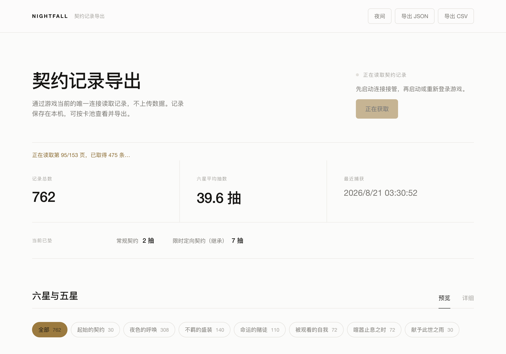
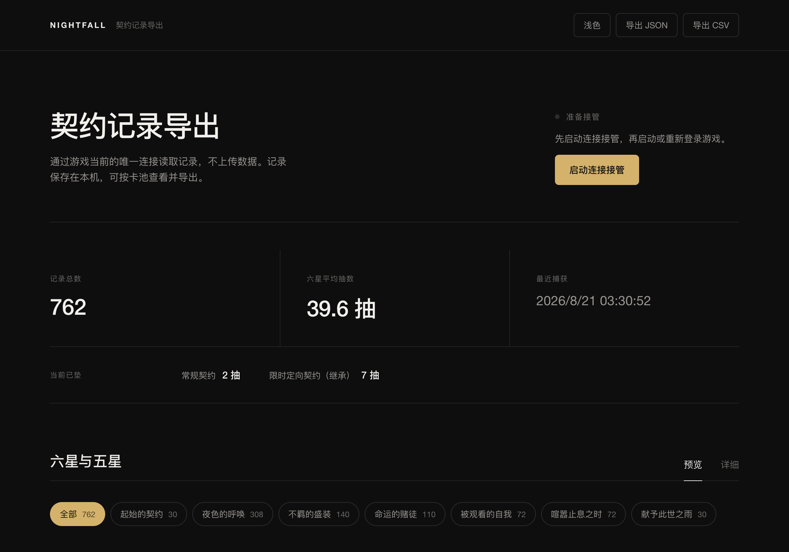

# 夜幕之下抽卡记录导出

一个面向 Windows 版《夜幕之下》的本地契约记录读取、保底统计与导出工具。



工具通过本机透明代理接管游戏原本的 TCP 连接，在同一登录会话内读取契约历史；首次读取全部分页，之后通常只读取新增记录并用一页旧记录校验衔接。不注入游戏进程，不读取账号密码，不复用登录令牌另开连接，也不向第三方服务器上传数据。记录保存在本机，可按卡池查看并导出为 JSON 或 CSV。界面重点展示五星、六星，以及每次六星在对应保底组中的累计位置和实际垫抽数。

> 当前处于早期版本。游戏更新后，协议命令或字段语义可能变化；如果读取失效，请通过 GitHub Issues 反馈。

## 免责声明

本工具通过接管《夜幕之下》客户端与服务器之间的本机连接来读取你自己的抽卡记录，**仅在本机读取、不修改游戏数据、不上传、不触碰账号密码**。使用前请知悉以下风险，并自愿使用：

- 游戏厂商的用户协议通常限制第三方工具介入客户端通信。本工具虽然只读取记录、不改动任何数据，理论上仍可能被判定为违规，由此产生的账号风险由使用者自行承担。
- 本工具仅供学习交流与个人备份用途，与游戏官方无关；作者不对使用后果（含但不限于封号、数据丢失）承担责任。
- 需要管理员权限以接管本机网络连接，请务必从官方仓库获取本程序，不要运行来源不明的构建。

程序首次运行时会展示同样的风险告知并要求确认后方可使用。

## 下载

在 [GitHub Releases](https://github.com/MILImusic/nightfall-gacha-export/releases/latest) 下载最新 Windows 压缩包，解压后运行 `夜幕之下抽卡记录导出.exe`。

工具启动时会静默检查更新。只有发现新版本时，顶栏才显示“更新版本”；点击后会下载并做 SHA-256 校验，校验通过的新版本存入数据目录并自动重启生效。整个过程不调用任何外部脚本或系统命令；新版本启动失败时会自动回退到安装目录内置的版本。

## 使用方式

1. 若正在使用 Clash Verge 的 TUN 模式，请先临时关闭 Clash；当前版本尚不能与其 Meta/TUN 默认路由共存。
2. 在启动或登录游戏前打开本工具。
3. 点击“启动连接接管”，在 UAC 窗口中允许管理员权限。
4. 启动游戏并登录；若游戏已在线，需要重新登录一次。接管成功后按钮会变成“获取全部记录”：

   

5. 进入“契约记录”，点击工具中的“获取全部记录”。
6. 等待工具自动读取并校验记录，再按卡池查看或导出 JSON / CSV。首次会读取全量，后续只抓新增记录；关闭工具后即可恢复 Clash。

   


读取期间不需要移动鼠标、按快捷键或手动翻页。

界面提供浅色 / 夜间两套主题，右上角随时切换：



## 功能

- 首次读取全部契约历史，后续只读取新增记录并校验一页重叠；校验不符会自动回落全量。
- 自动识别新手池、常驻池、常驻限定池和限定池；同类活动池按真实规则继承保底。
- 突出展示五星、六星、六星获得抽数、平均六星抽数和各保底链当前已垫。
- 全部记录按时间排序，卡池类型以标签区分；预览和详细记录均支持分页。
- 浅色/夜间主题，主题选择保存在本机。
- 导出完整 JSON / CSV；低星和内部 ID 不在主界面喧宾夺主，但会保留在导出数据中。
- 启动静默检查 GitHub Release，发现新版后支持应用内直接更新。

### 为什么必须先启动接管

原神、崩铁等导出器通常从抽卡页面取得临时 `authKey`，再调用独立的历史 Web API；导出查询和游戏主连接互不抢占。《夜幕之下》的历史命令则复用游戏唯一的长连接 TCP 会话，每页只返回 5 条。代理必须从这条连接建立时就在场，不能在登录后安全地半途接管，因此需要先启动接管，再登录游戏；进入抽卡页后仍然只需点击一次获取。

## 数据与隐私

- 本地数据保存在 Electron 的应用数据目录中。
- 仓库不会收集或包含登录令牌、Cookie、设备标识、原始网络包或个人抽卡数据。
- 代理只处理游戏服务器的 TCP `12090` 端口；关闭工具后，接管进程会随之退出。
- `.gitignore` 排除网络包、日志、导出目录与 `.env` 文件。
- 若要提交问题，请先删除截图和日志中的账号信息。
- 更新检查只请求本项目的 GitHub Release API，不上传本地抽卡记录。

## 遇到问题

v0.1.4 起，工具在打开和启动接管时会自动检查环境（系统代理、防火墙覆盖、内存完整性、DNS 残留），发现问题会直接在界面上给出黄色提示和解决办法，优先照提示处理。若仍卡在“正在启动”或接管后读不到记录，按下面顺序排查：

1. **管理员授权弹窗**：启动接管需要管理员权限，弹窗有时会被挡在其他窗口后面。按 `Alt+Tab` 找到深色的 UAC 授权框并点“是”。（v0.1.3 起，30 秒未完成会给出明确提示，不再无限等待。）
2. **防火墙**：接管走本机局域网连接。若 Windows 防火墙把你的网络判成“公用”而弹窗只勾了“家用/专用”，连接会被静默拦截。到「控制面板 → Windows Defender 防火墙 → 允许应用」里把本工具的“公用”一列也勾上，或把当前网络配置文件改成“专用”。
3. **加速器 / VPN**：UU、雷神、Clash 等会改写路由，与接管冲突。请彻底退出（含托盘图标）后重试。退出后若网络仍不对（系统代理没关干净、DNS 还指着加速器），点右上角 **“修复网络残留”**：它会关闭残留的系统代理并清空 DNS 缓存；DNS 被改的情况工具会在界面上提示你手动改回“自动获得”。
4. **内存完整性 / 杀毒软件**：系统「内核隔离 → 内存完整性(HVCI)」开启时会拦截接管驱动，可关闭后重启再试；360 / 火绒等若弹拦截提示，请选择允许。

排查不出时，点右上角 **“复制诊断信息”**，把复制到的文本（含所选网卡、驱动状态、防火墙规则、内存完整性等，均为本机技术信息、不含账号）贴到 GitHub Issue 里，可快速定位。

## 已知限制

- 当前透明接管与 Clash Verge 的 TUN 模式冲突。使用时请先关闭 Clash，读取完成并退出工具后再恢复。
- 每次游戏重新建立连接前必须先启动“连接接管”；工具无法安全地从一条已经建立的游戏连接中途插入。
- 旧版本保存的记录没有服务器原始位置，同一十连的精确先后可能只能显示约数；使用新版完整读取一次即可补齐。

## 开发

需要 Node.js 20 或更新版本。

```bash
npm install
npm test
npm run lint
npm run start
```

构建 Windows zip：

```bash
npm run build:win
```

透明转发助手基于 WinDivert 官方 `streamdump` 示例改写，源码在 `native/nightfall_redirect.c`；发行包包含 WinDivert 2.2.2 的官方签名驱动和动态库，第三方许可证随文件放在 `resources/windivert/`。

## 已确认的协议

- 游戏主连接：TCP `12090`
- 历史命令：`0x000c08`
- 请求字段：卡池 ID、从 0 开始且每页递增 5 的记录偏移
- 响应字段：偏移回显、总记录数、每页 5 条记录；固定头另含错误码
- 单条记录：实际卡池 ID、结果 ID、毫秒时间戳

“全部记录”的筛选卡池 ID 为 `0`。首次使用时工具按页读取完整历史，并使用“卡池 + 结果 + 时间 + 同值序号”保留十连中同毫秒出现的重复结果。后续读取会先比较服务器总数，只抓“新增条数 + 一页旧记录”，再用卡池、结果和时间组成的指纹核对新旧边界；边界变化或本地数据不完整时会自动退回全量校验，失败不会覆盖已有记录。

结果名称、角色和稀有度由仓库内的版本化卡牌表解析。玩家界面只显示中文名称，不展示内部 ID；原始 ID 仅保留在 JSON/CSV 中供诊断。保底按协议的卡池命名空间自动分类：`100xx` 起始契约、`20001` 常规契约、`20002–29999` 常驻遴选契约、`30000–39999` 限时定向契约；其中遴选和限时定向各自在同类更替池之间继承，四种类型互不串线。界面的“当前已垫”也按这些继承链分别累计，切换活动卡池不会把同类继承进度错误清零；30抽结束的起始契约不再显示当前垫抽。“全部”预览仍按抽取时间从新到旧，只用类型签区分六星与五星，不按类型重排记录。新一期池无需更新名单即可自动归类；超出已知命名空间的池会保持独立，避免静默误算。

旧版保存的记录缺少服务器原始位置；同一十连的时间戳可能完全相同，因此升级后需要重新执行一次“获取全部记录”，工具才会把精确顺序补回本地。原记录不会丢失或重复。

## 致谢

交互流程与本地数据合并思路参考了 [genshin-wish-export](https://github.com/biuuu/genshin-wish-export)。本项目没有复制其源代码，采集协议与实现均针对《夜幕之下》独立完成。

透明转发使用 [WinDivert](https://github.com/basil00/WinDivert)，其组件遵循随包附带的 LGPL/GPL 许可证。

应用图标取自《夜幕之下》“造梦制片人·NG”一阶段缩略图，来源与单独说明见 [`resources/ICON_SOURCE.md`](resources/ICON_SOURCE.md)。

## License

应用代码采用 [MIT](LICENSE)；WinDivert 及派生的原生转发助手见 `resources/windivert/LICENSE-WinDivert.txt` 与源码文件头。游戏图像不包含在 MIT 授权范围内。
